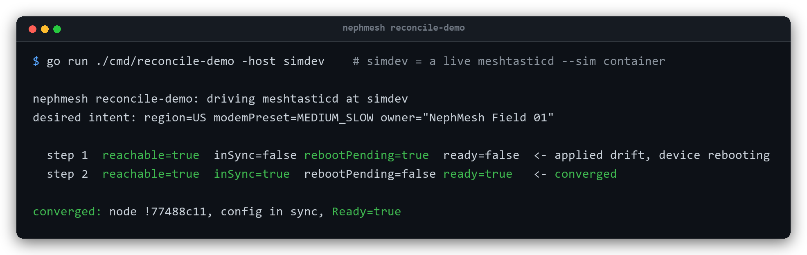
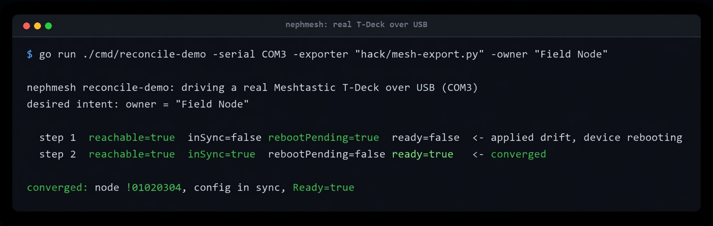

# NephMesh

**Intent-driven desired state configuration for communications: declare the comms system you want, and keep it running even when there is no carrier.**

Cellular networks fail, and not only in rare emergencies. Wildfire seasons and earthquakes knock out cell service somewhere every year; add hurricanes, floods, and ordinary grid outages, and "no signal" is a routine condition, not a doomsday one. The radio technologies that keep working when the towers do not (LoRa mesh, license-free ISM bands, software defined radio) are configured by hand today, one device at a time. NephMesh explores managing them the way modern telecom manages 5G: as declared, version-controlled, continuously reconciled desired state, using the [Nephio](https://nephio.org) model of Kubernetes-native, intent-driven, Configuration-as-Data automation. It is the same design instinct that shaped early packet-switching research: assume the infrastructure can be lost, and build communications that route around the loss.

Secure communication is a core goal, not an afterthought. Meshtastic channels are AES-256 encrypted, and NephMesh treats private channels as first-class: a team, a family, or a response group gets its own encrypted channel, its pre-shared key lives in a Kubernetes Secret and never in Git, and keys can be rotated as declared policy. Be precise about what that buys: a shared channel key gives confidentiality with a non-default key, but not per-sender authentication (any channel member can impersonate any other), and the [threat model](docs/security/threat-model.md) states these limits plainly rather than implying "encrypted" means "authenticated." Open public channels (the free community relief net anyone in range can join) and private, authenticated group coordination are both first-class: the same declarative machinery provisions either, and security is core precisely because it has to hold across that whole range.

> **Disclaimer:** NephMesh is an independent, experimental open-source project. It is not affiliated with, endorsed by, or part of the official Nephio project, LF Networking, or The Linux Foundation. It consumes Nephio components as an ordinary third-party user, the same pattern other projects use to ship their own Nephio-ready packages.

## The idea

Declare in Git: *"edge site X shall run a mesh gateway on channel preset Y, bridge it to MQTT, prefer cellular when available, and report spectrum occupancy."* The system makes it so, keeps it so, and feeds sensed RF conditions back into the intent loop. The scope is radio systems broadly, not one product:

- **LoRa mesh, starting with [Meshtastic](https://meshtastic.org)** as the first driver, because it has the most complete programmable control surface. The abstraction is meant to widen to other LoRa ecosystems (LoRaWAN, other mesh firmwares) over time. No Meshtastic Kubernetes operator exists today (last verified 2026-08-05 against the Meshtastic ecosystem; the closest projects are apps or blind-push scripts, none doing a declarative observe-diff-reconcile loop); building the first one is the most broadly useful near-term deliverable, and it doubles as the reference for what a radio "driver" looks like here.
- **Software defined radio** (the HackRF Pro and cheaper receivers) as a co-equal pillar, not a mesh accessory: containerized, fleet-managed spectrum sensing today, with room for a much larger SDR possibility space later. Receive-only by default.
- Later, a **lightweight 5G core** with a simulated RAN as the cellular leg of a hybrid failover fabric.

The through-line is a radio-agnostic intent model: any radio with a control surface worth reconciling can become a driver. Our research found every pairwise combination of these ideas in the wild, but not this specific three-way intersection (declarative KRM intent, a decentralized LoRa mesh, and co-located commodity-SDR sensing feeding the loop): see the [gap analysis](docs/research/prior-art-and-lab.md) and the [landscape synthesis](docs/research/resilient-comms-landscape.md). The closest philosophical neighbor is [Reticulum](https://reticulum.network), a crypto-native, transport-agnostic mesh that already delivers much of the resilience story; what NephMesh adds is the Kubernetes and GitOps management plane and the SDR feedback loop, and Reticulum is a candidate managed driver rather than a competitor. Whether any of it deserves to exist is part of what the experiment is for.

One thing to be clear about up front, because it is easy to misread: the Kubernetes control plane is not in the field. It provisions and manages the mesh from a powered site; the deployed Meshtastic nodes run autonomously once configured and keep carrying traffic even if the cluster, and the site running it, are gone. NephMesh is a management layer, not a runtime dependency of the mesh. In PACE terms (Primary, Alternate, Contingency, Emergency), it prepares and maintains the contingency tier before you need it.

The accurate framing of the value, and the honest limits, is "desired-state management for resilient radio fleets, with spectrum awareness and hybrid contingency," not "Meshtastic with Kubernetes." Physics caps the useful envelope at tens to low hundreds of nodes carrying low-bandwidth contingency traffic, and the audience is organized-operator resilience rather than a single hobbyist with five nodes. Where the project would grow if the core earns it, and why the core comes first, is written up as a design direction in the [doctrine](docs/design/doctrine.md); most of it is deliberately not built yet.

## Status

Pre-alpha, and further along than that sounds. **0.2.0** shipped the flagship: the `MeshtasticNode` operator, built in Go and validated against a live `meshtasticd --sim` device in CI (it reconciles region, modem preset, role, owner, and MQTT with a broker password read from a Secret), packaged as a kpt blueprint, and hardened with an envtest controller tier and assume-breach control-proving tests. 0.1.0 shipped the Phase 1 virtual mesh demo (a node deployed, configured, observed on MQTT, and torn down declaratively; transcript in [demo/phase1](demo/phase1/README.md)). The Go code holds lint, coverage, race-detector, and vulnerability-scan floors, with SHA-pinned CI actions. Since then, the operator has also driven a physical Meshtastic T-Deck over USB: its own reconcile loop read the device, applied a config change over serial, the device rebooted, and it re-verified to `Ready`, the core of the 0.4 gate (the operator reconciling drift on real hardware).

**0.2.1** completes the operator's configuration surface and makes it observable: it now reconciles secure channels and their pre-shared keys, the whole channel set, diffed by key hash and applied through a distinct path with the keys kept off the command line, validated end to end against `meshtasticd --sim` in CI on every commit; it reads the radio's own airtime telemetry and surfaces channel utilization and transmit airtime as Prometheus metrics and an `AirtimeHealthy` condition (airtime, not node count, is the LoRa scaling wall); and it gained a design doctrine and decision records ([doctrine](docs/design/doctrine.md), [ADRs](docs/adr/)) that frame where it grows next, deliberately behind a rock-solid core. Demo captures land here as each milestone ships.

Since 0.2.1 (unreleased, pre-alpha): the operator gained an intent layer above per-device config. A report-only [`CommunicationIntent`](examples/regional-intent.yaml) compiles an outcome (a region, an approved set of modem presets, channels, and target nodes) into the concrete `MeshtasticNode` specs that satisfy it, reports a feasibility and a fleet-wide airtime-budget verdict, and never actuates (ADR 0001, enforced by RBAC and an envtest admission suite). Two agent-facing tools expose it, a `nephmeshctl` CLI and a `nephmesh-mcp` [Model Context Protocol](docs/guides/agent-interface.md) server, so an AI agent or a script can dry-run a mesh design with no cluster and no hardware. The SDR pillar took its first real steps: a receive-only spectrum sensor ([`internal/spectrum`](operators/meshtastic-operator/internal/spectrum) plus a Prometheus exporter) reduces a `hackrf_sweep` to per-band occupancy, peak, and noise floor, validated against a real HackRF Pro. And the two pillars were shown to close a loop on real radios: the operator's reconcile loop changed a physical Meshtastic T-Deck's modem preset, and the HackRF Pro, sensing independently, saw the transmission move to the new channel frequency, with the node's own airtime telemetry and the external sensor agreeing. A hand-driven [closed-loop proof of concept](demo/closed-loop/) (sense, decide, actuate, verify) ran on the bench. These demonstrate the core thesis, that sensed spectrum can inform reconciled intent, on real hardware; autonomous actuation stays deliberately gated behind the safety work (ADR 0002).

*NephMesh's real reconcile loop (the `Converge` state machine and CLI-backed device client the controller uses), run against a live `meshtasticd --sim` via the `cmd/reconcile-demo` tool. Step 1 detects drift, applies only the minimal config, and reboots the device; step 2 re-verifies and reports `Ready` with the device's real node id. Captured from an actual run, not a mock-up.*

*The same loop against a physical device: the operator read a real Meshtastic T-Deck, applied a config change over USB serial, the board rebooted, and it re-verified to `Ready` with the device's real node id (then restored the original value). The default transport is TCP/IP on port 4403 (a WiFi or Ethernet node, or `meshtasticd` on a gateway); USB serial is the added path for a directly-attached board.* Contributions, questions, and skepticism are welcome.

## Start here

| Doc | What it covers |
|---|---|
| [Roadmap](docs/roadmap.md) | Phased plan in dependency order, the version path to 1.0, and how much runs with zero hardware (most of it) |
| [Design doctrine](docs/design/doctrine.md) | The design direction (mostly not built): intent as an outcome envelope, `MeshtasticNode` as a compiled artifact, airtime as a commons, and the honest boundaries. Read as a north star, not a feature list |
| [Decision records](docs/adr/) | The significant, hard-to-reverse decisions and why, in Context/Decision/Consequences form |
| [FAQ](docs/faq.md) | The north star (a self-adapting multi-transport fabric), why Meshtastic first, secure private channels, power and autonomy, PACE/DIL, legality |
| [Architecture](docs/architecture.md) | Components, the radio-driver seam, planned CRDs, data flows, design principles |
| [Regulatory matrix](docs/reference/regulatory-matrix.md) | Informal per-region band, duty-cycle, power, and encryption-legality notes; verify against primary sources |
| [Nephio compatibility](docs/reference/nephio-compatibility.md) | Where the code stays Nephio-consumable and where it diverges on purpose, with a dated check of upstream API-group and library versions |
| [Plans](docs/plans/) | Implementation and design plans: the phases and the operator, plus the intent-layer frontier (CommunicationIntent and the compiler, signed autonomy and the safety kernel, rejoin as a treaty, key rotation, message authentication, contingency semantics) |
| [Research](docs/research/) | Sourced research: Nephio mechanics and codebase conventions, Meshtastic, SDR, prior art, terminology and legality, and a [resilient-comms landscape synthesis](docs/research/resilient-comms-landscape.md) (DTN, adversarial mesh, LoRa prior art, Reticulum/MeshCore) |
| [Operations runbook](docs/guides/operations.md) | Install, declare a node, observe (conditions, events, metrics), troubleshoot, and day-2 (key rotation, decommission, upgrade) |
| [Guides](docs/guides/) | How-to guides, for example registering the packages with Nephio Porch |
| [Examples](examples/) | Starting-point `MeshtasticNode` resources: a basic node and a secure-private-channel node with its Secret |
| [Code quality standards](docs/CODE-QUALITY-STANDARDS.md) | The engineering bar (race, fuzzing, govulncheck, envtest, assume-breach tests), what is enforced, and honest gaps |
| [Agent playbook](docs/agent-playbook.md) | Tool-agnostic commands and entry points for any coding agent or human |
| [AGENTS.md](AGENTS.md) | Conventions for AI coding agents; the repo is agent-native from day one |
| [DISCLAIMER](DISCLAIMER.md) | Research-project and lawful-use terms: legality is your responsibility |
| [Threat model](docs/security/threat-model.md) | Security-first analysis with unmitigated risks named honestly |

## Cost, legality, and responsibility

Everything runs at $0 first: simulated radios, a simulated RAN, and kind/k3s on machines you already own. Real hardware (a ~$20 LoRa board, a ~$35 receive-only SDR) enters only when you want RF to be real.

This is a research project. Its SDR side is receive-only, and nothing here uses a software defined radio to transmit or to raise power. A Meshtastic mesh node transmits by design on license-free bands as its normal function, which the operator configures. Radio and encryption rules vary by country, band, and licensing, they change, and no one here claims to know the laws that apply to you. **You are solely responsible for ensuring that anything you do with this code and any radio hardware is legal where you are.** Please read the [DISCLAIMER](DISCLAIMER.md); any legality notes in the docs are informal, US-scoped, non-lawyer research, not legal advice. Security posture and known gaps: [threat model](docs/security/threat-model.md).

## License

[Apache 2.0](LICENSE)
